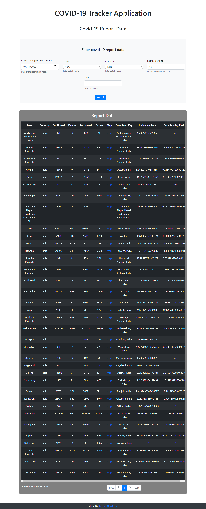

# covid-19-tracker
COVID-19 Tracker Daily Report Application

Spring Boot MVC Java web app to track daily coronavirus confirmed cases across the globe with data source from https://github.com/CSSEGISandData/COVID-19.

:warning: You may face some DB issues in live version due to use of test db in live version.
I recommend that you can download the project and run at your end for better result.

Full page view of live version

